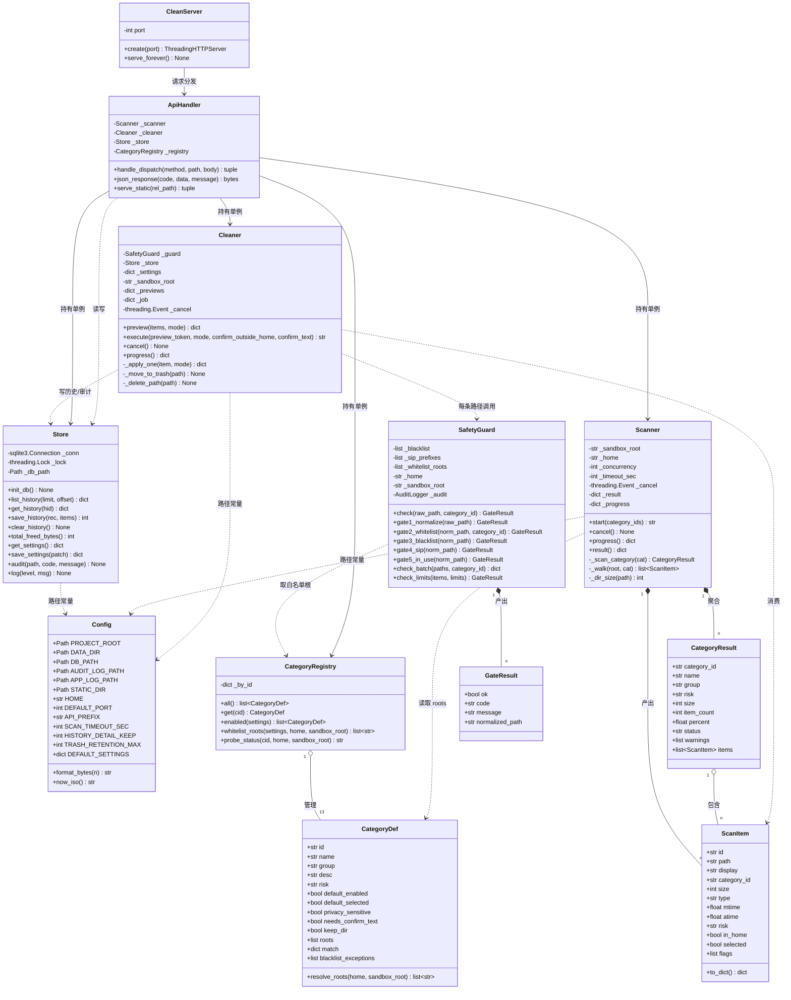
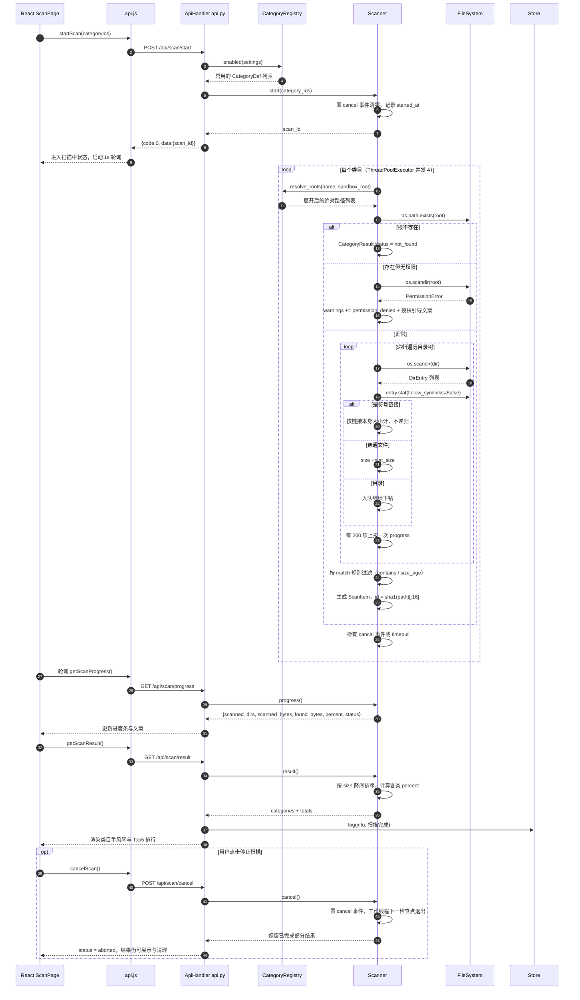
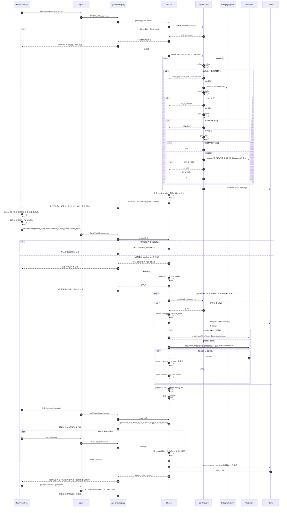
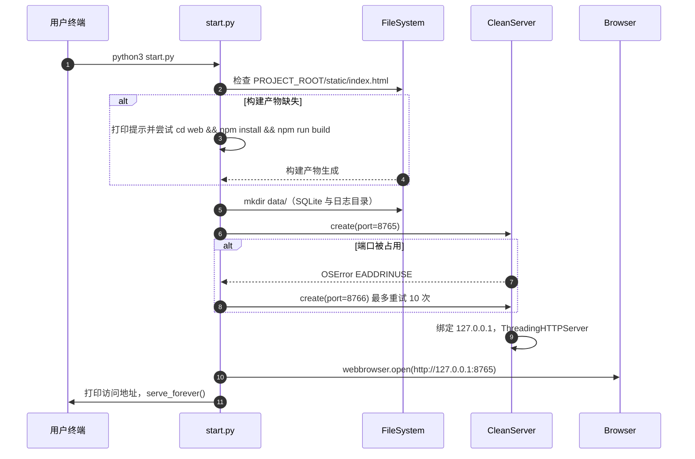
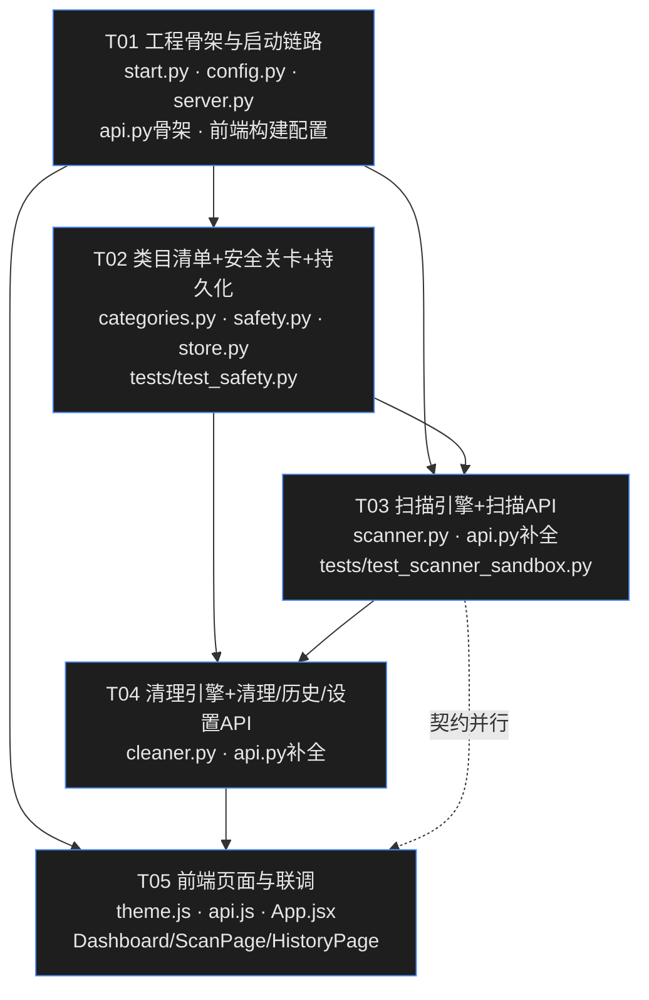

# macOS 磁盘清理工具 — 系统架构设计与任务分解

| 项目 | 内容 |
| --- | --- |
| 项目名称 | `mac-cleaner` |
| 文档版本 | v1.0 |
| 撰写人 | 高见远（架构师） |
| 上游输入 | `docs/PRD.md` v1.0（许清楚） |
| 目标平台 | macOS（darwin，Apple Silicon / Intel 通用） |
| 后端 | Python 3 标准库，**零第三方依赖** |
| 前端 | Vite + React + MUI + Tailwind CSS |
| 项目根 | `/Users/bing1111/WorkBuddy/2026-09-19-11-42-22/mac-cleaner/` |

---

## 1. 实现方案与框架选型

### 1.1 核心技术难点

| # | 难点 | 设计对策 |
| --- | --- | --- |
| D1 | **删除操作不可逆，误删即事故** | 把安全校验抽成**独立、无状态、可单测**的 `SafetyGuard` 模块，五道关卡串行短路执行，任一不通过即拒绝 + 留痕。UI 侧再叠 dry-run 预览、二次确认、高危输入式确认 |
| D2 | **百万级小文件扫描慢** | `concurrent.futures.ThreadPoolExecutor`（I/O 密集，GIL 影响小）+ 符号链接不递归 + 逐目录增量进度上报 + 5 分钟超时熔断 + 随时取消 |
| D3 | **权限不足不能中断整体流程** | 扫描器内部对 `PermissionError / FileNotFoundError / OSError` 全部降级为类目级 warning，汇总到 `CategoryResult.warnings`，绝不向上抛 |
| D4 | **零第三方依赖下实现"移到废纸篓"** | 不使用 `send2trash`，改为 `shutil.move` 到 `~/.Trash/<basename>.<uniq>`，UI 明示"可从废纸篓手动恢复、需清空废纸篓才真正释放空间" |
| D5 | **前后端必须一个端口、一条命令** | 后端 `http.server.ThreadingHTTPServer` 同时托管 `static/` 与 `/api/*`；`start.py` 负责构建产物检查 → 拉起服务 → `webbrowser.open` |
| D6 | **QA 不能碰真实目录** | 扫描引擎与清理引擎**构造时注入 `sandbox_root`**，所有类目根路径在沙箱模式下被重映射，生产模式 `sandbox_root=None` |

### 1.2 选型结论

| 层次 | 选型 | 理由 |
| --- | --- | --- |
| HTTP 服务 | `http.server.ThreadingHTTPServer` + `BaseHTTPRequestHandler` | 标准库内置；`ThreadingHTTPServer` 天然支持并发请求，避免扫描/清理期间 UI 轮询被阻塞 |
| 并发 | `concurrent.futures.ThreadPoolExecutor` | 标准库；`os.scandir` 为 I/O 密集，线程足够；`future.cancel()` 语义清晰，配合自定义 cancel 事件实现 ≤3 秒响应中止 |
| 持久化 | `sqlite3`（`data/mac_cleaner.db`） | 标准库；支持事务（历史 + 明细一次提交）；`check_same_thread=False` + 单写线程封装即可满足并发安全 |
| 磁盘容量 | `os.statvfs` | 标准库，与"关于本机"口径一致 |
| 目录遍历 | `os.scandir` + `entry.stat(follow_symlinks=False)` | 比 `os.walk` 快 2~3 倍；`follow_symlinks=False` 直接满足 STAT-06（软链按链接本身计，不递归） |
| 前端框架 | React 18 + Vite 5 | 构建快（≤15 秒启动约束）；无 Router 依赖，三页用 Tab 状态切换即可，减少一个依赖 |
| UI 组件 | MUI v5 | 内置深色主题、`prefers-color-scheme` 支持、Dialog/Accordion/Snackbar 等清理确认场景刚需组件 |
| 样式 | Tailwind CSS 3（布局/间距）+ MUI `sx`（组件） | Tailwind 负责页面级栅格与响应式，MUI 主题负责语义色，二者边界清晰不乱 |
| 图表 | **不引入图表库**，用 MUI `LinearProgress` /自绘 SVG 环形图 | 需求仅需环形容量图 + 横向条形图，自绘约 60 行，省去 recharts 依赖与体积 |

### 1.3 架构模式

- **后端**：分层架构（Presentation `api.py` / Domain `scanner.py` `cleaner.py` `safety.py` / Data `store.py` `categories.py`）。领域层**不感知 HTTP**，可被测试直接调用。
- **前端**：容器/展示分离 + 单一全局 Context（`App.jsx` 内 Provider + reducer），页面组件只消费状态。
- **通信**：前端轮询（扫描/清理进度 1s 一次），避免 SSE/WebSocket 复杂度。

---

## 2. 完整文件列表

### 2.1 后端（运行时 10 个文件）

| # | 相对路径 | 职责 | 预估行数 |
| --- | --- | --- | --- |
| B1 | `start.py` | **一条命令入口**：检查 `static/index.html` 是否存在（缺失则提示先 `npm run build` 或自动构建）、端口探测、写入 `data/app.log`、启动服务、`webbrowser.open`、捕获端口占用并自动 +1 重试 | 120 |
| B2 | `server/__init__.py` | 包声明，导出 `__version__` | 5 |
| B3 | `server/config.py` | **共享知识中枢**：路径常量、端口、错误码枚举、风险等级枚举、原因码枚举、默认设置字典、字节/时间格式化工具 | 180 |
| B4 | `server/categories.py` | **类目清单（白名单唯一来源）**：13 个类目定义、根路径解析、存在性降级、开关合并、类目分组 | 260 |
| B5 | `server/safety.py` | **五道安全关卡**：`SafetyGuard` + 5 个独立 gate 函数 + 黑名单/SIP 前缀表 + 批量校验 + 上限校验 | 300 |
| B6 | `server/scanner.py` | **扫描引擎**：可注入 `sandbox_root`、并发遍历、体积统计（不跟软链）、进度上报、取消、超时、权限降级、结果聚合与缓存 | 380 |
| B7 | `server/cleaner.py` | **清理引擎**：dry-run 预览（生成 preview_token 快照）、后台执行、逐条走 `SafetyGuard`、废纸篓/直删两种模式、逐项回执、中断、汇总写历史 | 380 |
| B8 | `server/store.py` | **持久化**：SQLite 建表/读写（历史、明细、设置 KV）、最近 5 次明细裁剪、文件日志（app.log / audit.log） | 260 |
| B9 | `server/api.py` | **REST 路由**：路由表、JSON 编解码、统一响应包装、静态文件托管、18 个 API handler、全局异常兜底 | 420 |
| B10 | `server/server.py` | **HTTP 服务**：`ThreadingHTTPServer` 子类（仅绑 `127.0.0.1`）、请求日志静音、优雅退出、`create_server(port)` 工厂 | 90 |

### 2.2 前端（12 个文件）

| # | 相对路径 | 职责 | 预估行数 |
| --- | --- | --- | --- |
| F1 | `web/package.json` | 依赖声明 + `dev/build/preview` 脚本 + **内联 postcss 配置**（省一个文件） | 50 |
| F2 | `web/vite.config.js` | React 插件、`outDir: '../static'`、`emptyOutDir: true`、dev proxy `/api` → `127.0.0.1:8765` | 30 |
| F3 | `web/tailwind.config.js` | content 扫描路径、语义色 token（与 MUI 对齐）、深色模式 `class` 策略 | 40 |
| F4 | `web/index.html` | 挂载点、`<title>Mac 清理助手</title>`、深色 `color-scheme` meta | 20 |
| F5 | `web/src/index.css` | Tailwind 三条指令 + 滚动条/字体等少量全局样式 | 40 |
| F6 | `web/src/main.jsx` | `createRoot` + `CssBaseline` + `ThemeProvider` + 渲染 `<App/>` | 25 |
| F7 | `web/src/App.jsx` | **应用外壳**：顶栏（产品名/Tab 导航/主题切换/设置齿轮）、全局 Context Provider + reducer、`Snackbar`、设置抽屉、页面切换 | 300 |
| F8 | `web/src/theme.js` | MUI 深色/浅色主题、颜色语义常量、`formatBytes`、`RiskBadge`、`SizeText`、`EmptyState` 等通用小组件 | 180 |
| F9 | `web/src/api.js` | 全部 REST 调用封装（18 个方法）、统一错误拆包（不暴露 traceback）、轮询辅助 `pollUntil` | 200 |
| F10 | `web/src/pages/Dashboard.jsx` | 首页：磁盘环形图、累计释放卡片、Top5 类目条形图、安全提示条、快速设置 Chips、开始/重新扫描 | 260 |
| F11 | `web/src/pages/ScanPage.jsx` | 扫描清理页：扫描状态条、吸顶汇总栏、筛选 Chips/排序/搜索、类目手风琴（含无权限提示）、**清理确认弹窗**、**清理进度与结果汇总弹层** | 520 |
| F12 | `web/src/pages/HistoryPage.jsx` | 历史页：累计卡片、记录列表、明细抽屉、清空历史（二次确认）、导出日志 | 240 |

### 2.3 测试与数据（不计入主文件数）

| 相对路径 | 职责 | 预估行数 |
| --- | --- | --- |
| `tests/test_safety.py` | 五道关卡单元测试：黑名单全覆盖、`..` 穿越、软链逃逸、空/根路径熔断、白名单外拒绝 | 200 |
| `tests/test_scanner_sandbox.py` | 沙箱扫描测试：`Scanner(sandbox_root=tmpdir)` 体积与 `du` 偏差、权限降级、取消、软链不递归 | 180 |
| `tests/test_clean_e2e_sandbox.py` | **清理链路端到端测试**：扫描 → 预览（dry-run）→ 二次确认 → 执行 → 移入废纸篓 → 写历史 → 累计释放量；含黑名单拦截、主目录外确认、高危确认文本、单次上限四类拒绝路径（全程沙箱内，可在真机安全运行） | 300 |
| `data/.gitkeep` | 数据目录占位（SQLite / 日志运行时生成） | 0 |

**总计：后端 10 + 前端 12 + 测试 3 = 25 个文件**，符合"避免过度设计"约束。

---

## 3. 数据结构与接口定义

### 3.1 类图



### 3.2 类目表结构（`categories.py`）

```python
CategoryDef = {
    "id": "user_caches",
    "name": "用户缓存",
    "group": "cache",            # cache|log|temp|trash|dev|privacy|personal|external
    "desc": "存放 App 运行时产生的临时数据，删除后 App 会自动重建",
    "risk": "low",               # low|medium|high
    "default_enabled": True,     # 是否默认纳入扫描
    "default_selected": True,    # 是否默认勾选（Q5 下载目录 = False）
    "privacy_sensitive": False,  # Q3 浏览器缓存 = True
    "needs_confirm_text": False, # Q6 iOS 备份 = True
    "keep_dir": True,            # CLEAN-09 清内容保目录
    "roots": ["~/Library/Caches"],
    "match": {"kind": "all"},    # all | contains | size_age
    "blacklist_exceptions": []   # 例：ios_backup 例外放行 MobileSync/Backup
}
```

**13 个类目清单（白名单唯一来源）**

| id | 名称 | group | risk | 默认扫描 | 默认勾选 | 根路径 | 匹配规则 |
| --- | --- | --- | --- | --- | --- | --- | --- |
| `user_caches` | 用户缓存 | cache | low | ✅ | ✅ | `~/Library/Caches` | all |
| `app_caches` | 应用缓存 | cache | low | ✅ | ✅ | `~/Library/Containers/*/Data/Library/Caches`、`~/Library/Group Containers/*/Library/Caches`、`~/Library/Application Support/*/Caches` | contains `Cache` |
| `system_caches` | 系统级缓存 | cache | medium | ✅ | ✅ | `/Library/Caches` | all |
| `user_logs` | 用户日志 | log | low | ✅ | ✅ | `~/Library/Logs`（含 `DiagnosticReports`） | all（keep_dir） |
| `system_logs` | 系统日志 | log | medium | ❌（P1 默认关） | ✅ | `/Library/Logs`、`/private/var/log` | all（keep_dir） |
| `temp_files` | 临时文件 | temp | low | ✅ | ✅ | `/private/var/folders/*/{T,C}`、`/tmp` | all |
| `trash_residue` | 回收站残留 | trash | low | ✅ | ✅ | `~/.Trash` | all |
| `downloads_large` | 下载目录大文件 | personal | high | ✅（Q5） | ❌（Q5） | `~/Downloads` | size_age：≥100 MB 且 ≥30 天未访问 |
| `xcode_junk` | Xcode 开发垃圾 | dev | medium | ❌ | ✅ | `~/Library/Developer/Xcode/{DerivedData,Archives,iOS DeviceSupport}`、`~/Library/Developer/CoreSimulator` | all |
| `pkg_manager_caches` | 包管理器缓存 | dev | low | ❌ | ✅ | `~/.npm/_cacache`、`~/.cache/yarn`、`~/Library/pnpm-store`、`~/Library/Caches/Homebrew`、`~/.cargo/registry/cache`、`~/.gradle/caches`、`~/.m2/repository` | all（multi-root，逐根降级） |
| `browser_caches` | 浏览器缓存 | privacy | medium | ❌（Q3） | ✅ | `~/Library/Caches/com.apple.Safari`、`~/Library/Caches/Google/Chrome`、`~/Library/Caches/Firefox`、`~/Library/Caches/com.microsoft.edgemac.*`、`~/Library/WebKit` | all |
| `ios_backup` | iOS 设备备份 | personal | high | ❌（Q6） | ❌ | `~/Library/Application Support/MobileSync/Backup` | all + `needs_confirm_text` |
| `external_volumes` | 外置卷残留 | external | medium | ❌（Q2） | ✅ | `/Volumes/*/.Trashes`、`/Volumes/*/.Spotlight-V100` | all |

**存在性降级（PRD 第 9 节本机实测事实 → ERR-02）**

- 根路径探活 `probe_status()`：`exists` / `partial` / `not_found` / `permission_denied`。
- 全部根不存在 → 类目 `status = "not_found"`，前端显示「未检测到 / 未安装」，**不报错**。
- 已知本机不存在：`~/.cache/yarn`、`~/Library/pnpm-store`、`~/.docker`、`~/Library/Caches/Firefox`、`~/Library/Caches/Google` → `pkg_manager_caches` 与 `browser_caches` 呈 `partial` 并列出缺失子项。
- 已知本机存在：`~/Library/Caches`（≈1.4 GB）、`~/Library/Developer/Xcode/DerivedData`、`~/Library/Developer/CoreSimulator`、`~/.npm`、`~/Library/Caches/Homebrew`、`~/.cargo`。

### 3.3 扫描项结构（`ScanItem`）

```json
{
  "id": "a3f1c2...",
  "path": "/Users/alice/Library/Caches/com.spotify.Client",
  "display": "com.spotify.Client",
  "category_id": "user_caches",
  "size": 1288490188,
  "type": "dir",
  "mtime": 1758268800.0,
  "atime": 1758268800.0,
  "risk": "low",
  "in_home": true,
  "selected": true,
  "flags": ["privacy"]
}
```

`id` = `sha1(path)[:16]`，全局唯一，作为前端勾选与清理请求的**唯一引用**（请求体只传 id，不传路径，避免客户端伪造路径）。

### 3.4 类目聚合结果（`CategoryResult`）

```json
{
  "category_id": "user_caches",
  "name": "用户缓存",
  "group": "cache",
  "risk": "low",
  "desc": "存放 App 运行时产生的临时数据…",
  "size": 4294967296,
  "item_count": 328,
  "percent": 48.3,
  "status": "ok",
  "selected": true,
  "privacy_sensitive": false,
  "needs_confirm_text": false,
  "warnings": [
    { "code": "permission_denied", "count": 3, "message": "3 个目录无权限访问（位于主目录之外）",
      "guide": "需要授权访问，可在 系统设置 → 隐私与安全性 → 完全磁盘访问权限 中为本工具授权" }
  ],
  "items": [ "ScanItem..." ]
}
```

`percent` = 该类目 size / 全部**已勾选且通过安全校验**类目 size 之和 × 100，保留 1 位小数（STAT-02）。

### 3.5 清理请求 / 响应结构

**预览请求（CLEAN-01，dry-run，零写操作）**

```json
POST /api/clean/preview
{
  "items": ["a3f1c2...", "b7d2e1..."],
  "mode": "trash"
}
```

**预览响应**

```json
{
  "code": 0, "message": "ok",
  "data": {
    "preview_token": "pv_1758268800_9f3a",
    "mode": "trash",
    "summary": {
      "planned_items": 12,
      "planned_bytes": 6764573491,
      "category_count": 3,
      "in_home": { "items": 10, "bytes": 5476083302 },
      "outside_home": { "items": 2, "bytes": 1288490188 },
      "blocked": [
        { "item_id": "c1...", "path": "/Library/Apple/x", "code": "sip", "message": "受系统保护，已跳过" }
      ]
    },
    "top_paths": [
      { "path": "~/Library/Caches/com.spotify.Client", "size": 1288490188 }
    ],
    "requires": {
      "confirm_outside_home": true,
      "confirm_text": "确认删除"
    },
    "limit_ok": true
  }
}
```

`preview_token` 是服务端内存快照（TTL 10 分钟），执行时必须携带 —— 防止预览后路径被替换（TOCTOU）。

**执行请求**

```json
POST /api/clean/execute
{
  "preview_token": "pv_1758268800_9f3a",
  "mode": "trash",
  "confirm_outside_home": true,
  "confirm_text": "确认删除"
}
```

- 含主目录外项而 `confirm_outside_home != true` → 拒绝 `2002 CONFIRM_REQUIRED`（SEC-06）。
- 含 `needs_confirm_text` 类目而 `confirm_text != "确认删除"` → 拒绝 `2002`（SEC-07）。

**清理进度/结果（统一结构）**

```json
{
  "code": 0, "message": "ok",
  "data": {
    "job_id": "job_1758268801",
    "status": "running",
    "total": 120, "processed": 37,
    "current_path": "~/Library/Caches/com.apple.Safari/Cache.db",
    "freed_bytes": 2252341248,
    "success": 30, "skipped": 6, "failed": 1,
    "started_at": "2026-09-19T11:30:02+08:00",
    "history_id": null,
    "results": [
      { "item_id": "a3f1...", "path": "...", "size": 12345,
        "status": "success", "reason_code": null, "reason_text": null },
      { "item_id": "b7d2...", "path": "...", "size": 999,
        "status": "skipped", "reason_code": "in_use", "reason_text": "文件正在被其他程序使用，已跳过" }
    ]
  }
}
```

`status`：`idle | running | done | aborted | error`。中止后 `status=aborted`，已完成部分照常写入历史（CLEAN-05）。

### 3.6 历史记录表 DDL（`store.py`）

```sql
PRAGMA journal_mode=WAL;

CREATE TABLE IF NOT EXISTS clean_history (
    id             INTEGER PRIMARY KEY AUTOINCREMENT,
    started_at     TEXT    NOT NULL,               -- ISO8601 本地时间
    finished_at    TEXT,
    duration_ms    INTEGER NOT NULL DEFAULT 0,
    mode           TEXT    NOT NULL,               -- trash | delete
    item_count     INTEGER NOT NULL DEFAULT 0,
    success_count  INTEGER NOT NULL DEFAULT 0,
    skipped_count  INTEGER NOT NULL DEFAULT 0,
    failed_count   INTEGER NOT NULL DEFAULT 0,
    freed_bytes    INTEGER NOT NULL DEFAULT 0,
    status         TEXT    NOT NULL,               -- completed | aborted | error
    categories     TEXT    NOT NULL DEFAULT '[]',  -- JSON array of category_id
    has_detail     INTEGER NOT NULL DEFAULT 1
);
CREATE INDEX IF NOT EXISTS idx_history_started ON clean_history(started_at DESC);

CREATE TABLE IF NOT EXISTS clean_history_item (
    id          INTEGER PRIMARY KEY AUTOINCREMENT,
    history_id  INTEGER NOT NULL REFERENCES clean_history(id) ON DELETE CASCADE,
    path        TEXT    NOT NULL,
    size        INTEGER NOT NULL DEFAULT 0,
    category_id TEXT    NOT NULL,
    result      TEXT    NOT NULL,                  -- success | skipped | failed
    reason_code TEXT,
    reason_text TEXT
);
CREATE INDEX IF NOT EXISTS idx_item_history ON clean_history_item(history_id);

CREATE TABLE IF NOT EXISTS settings (
    key   TEXT PRIMARY KEY,
    value TEXT NOT NULL                            -- JSON
);
```

**最近 5 次明细裁剪（Q7）** —— 每次 `save_history` 提交后在同一事务内执行：

```sql
DELETE FROM clean_history_item
WHERE history_id NOT IN (
    SELECT id FROM clean_history ORDER BY started_at DESC LIMIT 5
);
UPDATE clean_history SET has_detail = 0
WHERE id NOT IN (
    SELECT id FROM clean_history ORDER BY started_at DESC LIMIT 5
);
```

前端对 `has_detail = 0` 的记录，「查看详情」按钮置灰并提示「本次明细已按策略归档，仅保留最近 5 次」。

### 3.7 设置项结构（`settings` 表 key = `app`，值为 JSON）

```json
{
  "mode": "trash",
  "scan_external_volumes": false,
  "category_enabled": {
    "user_caches": true, "app_caches": true, "system_caches": true,
    "user_logs": true, "system_logs": false, "temp_files": true,
    "trash_residue": true, "downloads_large": true, "xcode_junk": false,
    "pkg_manager_caches": false, "browser_caches": false,
    "ios_backup": false, "external_volumes": false
  },
  "category_default_selected": { "downloads_large": false, "ios_backup": false },
  "limits": {
    "max_bytes_per_clean": 21474836480,
    "max_items_per_clean": 50000
  },
  "downloads": { "min_size_bytes": 104857600, "min_days_unused": 30 },
  "scan": { "concurrency": 4, "timeout_sec": 300 },
  "appearance": "system"
}
```

默认值来自 `config.DEFAULT_SETTINGS`，读取时与库中值**深合并**，缺失键自动回落到默认（向前兼容）。

---

## 4. 五道安全关卡（`server/safety.py`）

> **硬约束**：该模块为纯函数式、无 HTTP/无 DB 写依赖（审计通过注入的回调），可被 `tests/test_safety.py` 100% 单测覆盖。

### 4.1 函数签名

```python
from typing import NamedTuple, Optional, List, Dict

class GateResult(NamedTuple):
    ok: bool
    code: str                 # 见 4.3 原因码枚举
    message: str              # 简体中文人类可读
    normalized_path: str      # 关卡一产出的 realpath

class SafetyGuard:
    def __init__(self,
                 blacklist: List[str],
                 sip_prefixes: List[str],
                 whitelist_roots: List[str],
                 home_dir: str,
                 audit=None,                     # Optional[Callable[[str, str, str], None]]
                 sandbox_root: Optional[str] = None) -> None:
        """sandbox_root 非空时，所有路径比较限制在沙箱内，供 QA 单测使用"""

    # —— 主控：串行短路，任一关卡失败立即返回，并调用 audit 留痕 ——
    def check(self, raw_path: str,
              category_id: Optional[str] = None,
              skip_in_use: bool = False) -> GateResult:
        """依次执行 gate1..gate5；skip_in_use=True 时跳过关卡五（预览阶段的轻量模式）"""

    # —— 单关卡（全部公开，均可独立单测）——
    def gate1_normalize(self, raw_path: str) -> GateResult:
        """路径规范化：展开 ~ 与环境变量 → 拒绝空串/'/'/$HOME → os.path.realpath
           解析符号链接 → 校验结果未逃出 sandbox_root"""

    def gate2_whitelist(self, norm_path: str,
                        category_id: Optional[str] = None) -> GateResult:
        """白名单：realpath 必须位于某个启用类目的展开根路径之下（前缀比较带 os.sep 边界）"""

    def gate3_blacklist(self, norm_path: str,
                        category_id: Optional[str] = None) -> GateResult:
        """黑名单：命中硬编码黑名单（除该类的 blacklist_exceptions）即拒绝"""

    def gate4_sip(self, norm_path: str) -> GateResult:
        """SIP：命中 SIP 保护前缀即拒绝，标记 protected_by_sip"""

    def gate5_in_use(self, norm_path: str) -> GateResult:
        """占用检测：文件尝试 os.open(O_RDWR|O_EXLOCK)；目录检查 os.access(W_OK)；
           失败/被锁返回 in_use，禁止重试强删"""

    # —— 批量与全局 ——
    def check_batch(self, paths: List[str],
                    category_id: Optional[str] = None,
                    max_workers: int = 4) -> Dict[str, GateResult]:
        """并发批量校验，返回 {path: GateResult}"""

    def check_limits(self, items: List[dict], limits: dict) -> GateResult:
        """SEC-09 单次清理上限：总量 > max_bytes_per_clean 或条目 > max_items_per_clean
           → code='limit_exceeded'，message 给出分批建议"""
```

### 4.2 关卡判定矩阵

| 关卡 | 输入 | 通过条件 | 拒绝码 |
| --- | --- | --- | --- |
| G1 路径规范化 | 原始路径字符串 | 非空、非 `/`、非 `~`/`$HOME`、`realpath` 成功、未逃出 `sandbox_root` | `empty_path` / `root_path` / `path_traversal` |
| G2 白名单 | realpath + 类目 id | 位于某启用类目的展开根之下（含该类 `blacklist_exceptions` 放行区） | `not_in_whitelist` |
| G3 黑名单 | realpath | 不命中黑名单精确项或前缀项 | `blacklist` |
| G4 SIP 判定 | realpath | 不命中 SIP 保护前缀 | `sip` |
| G5 占用检测 | realpath | 文件可独占打开 / 目录可写 | `in_use` / `permission_denied` |

**黑名单（`safety.BLACKLIST`，SEC-01 全覆盖）**
`/`、`/System/**`、`/usr/**`（`/usr/local/**` 除外）、`/bin`、`/sbin`、`/etc`、`/var/db`、`/private/var/db`、`/private/var/root`、`/Library/Apple/**`、`/Library/Preferences`、`/Library/Keychains`、`~/Library/Keychains`、`~/Library/Preferences`、`~/Library/Mail`、`~/Library/Messages`、`~/Library/Application Support/AddressBook`、`~/Library/Application Support/MobileSync`（`ios_backup` 例外放行 `…/MobileSync/Backup`）、`~/Documents`、`~/Desktop`、`~/Pictures`、`~/Movies`、`~/Music`、`~/Public`、`~/Library/Mobile Documents/**`

**SIP 保护前缀（`safety.SIP_PREFIXES`，SEC-02）**
`/System/Library`、`/usr/lib`、`/Library/Apple`、`/System/Volumes/Data/System`、`/private/var/db`

### 4.3 原因码枚举（`config.py`）

| code | 中文文案（UI 直接展示） |
| --- | --- |
| `ok` | 通过 |
| `empty_path` | 路径为空，已拒绝 |
| `root_path` | 拒绝清理根目录 |
| `path_traversal` | 路径含跳跃或符号链接逃逸，已拒绝 |
| `not_in_whitelist` | 不在可清理类目清单内，已拒绝 |
| `blacklist` | 属于受保护的关键目录，已拒绝 |
| `sip` | 受系统保护，已跳过 |
| `in_use` | 文件正在被其他程序使用，已跳过 |
| `permission_denied` | 无访问权限，已跳过 |
| `outside_home` | 位于主目录之外，需额外确认 |
| `limit_exceeded` | 单次清理量超限，建议分批清理 |
| `not_found` | 路径已不存在，已跳过 |
| `io_error` | 系统错误，已跳过 |

---

## 5. 程序调用流程

### 5.1 扫描流程时序图



### 5.2 清理执行流程时序图（含五道关卡判定分支）



### 5.3 服务启动流程



---

## 6. REST API 清单

**公共约定**

- Base URL：`http://127.0.0.1:8765`
- API 前缀：`/api`
- 请求/响应：`application/json; charset=utf-8`
- 统一响应体：`{ "code": 0, "message": "ok", "data": <任意> }`；`code != 0` 表示业务错误，`message` 为简体中文提示，`data` 为 `null` 或补充信息
- 前端**永不展示 traceback**；后端全部异常在 `api.py` 兜底为 `9001 INTERNAL_ERROR`，详情写入 `data/app.log`

| # | 方法 | 路径 | 请求体 | 响应体 `data` | 覆盖需求 |
| --- | --- | --- | --- | --- | --- |
| 1 | GET | `/api/health` | — | `{version, port, data_dir, db_path}` | SYS-01 |
| 2 | GET | `/api/disk/overview` | — | `{total_bytes, used_bytes, free_bytes, used_percent, reclaimable_bytes, cumulative_freed_bytes, clean_count, first_used_at}` | STAT-01, HIST-03/06 |
| 3 | GET | `/api/categories` | — | `{categories: [CategoryDef + status + enabled + selected]}` | SCAN-01, UI-07 |
| 4 | POST | `/api/scan/start` | `{category_ids?: string[], force?: bool}` | `{scan_id, started_at}` | SCAN-15 |
| 5 | GET | `/api/scan/progress` | — | `{status, scanned_dirs, scanned_bytes, found_bytes, found_items, elapsed_ms, current_category}` | SCAN-15, ERR-06 |
| 6 | GET | `/api/scan/result` | — | `{scan_id, status, elapsed_ms, totals:{reclaimable_bytes, item_count}, categories:[CategoryResult]}` | SCAN-14, STAT-02/03, SCAN-17 |
| 7 | POST | `/api/scan/cancel` | — | `{status:"aborted"}` | SCAN-16 |
| 8 | POST | `/api/clean/preview` | `{items: string[], mode: "trash"\|"delete"}` | `{preview_token, mode, summary, top_paths, requires, limit_ok}` | CLEAN-01, SEC-06/07/08/09 |
| 9 | GET | `/api/clean/preview/{token}/csv` | — | `text/csv` 附件（路径、大小、类目、操作时间） | SEC-12 |
| 10 | POST | `/api/clean/execute` | `{preview_token, mode, confirm_outside_home, confirm_text?}` | `{job_id, started_at}` | CLEAN-03/04, SEC-06/07 |
| 11 | GET | `/api/clean/progress` | — | `{job_id, status, total, processed, current_path, freed_bytes, success, skipped, failed, history_id, results[]}` | CLEAN-04/05/06 |
| 12 | POST | `/api/clean/cancel` | — | `{status:"aborted"}` | CLEAN-05 |
| 13 | GET | `/api/history?limit=50&offset=0` | — | `{total, cumulative_freed_bytes, clean_count, first_used_at, records:[{id, started_at, duration_ms, mode, item_count, success_count, skipped_count, failed_count, freed_bytes, status, categories, has_detail}]}` | HIST-01/02/03 |
| 14 | GET | `/api/history/{id}` | — | `{record, items:[{path, size, category_id, result, reason_code, reason_text}]}` | HIST-04, Q7 |
| 15 | DELETE | `/api/history` | `{confirm: true}` | `{cleared: n}` | HIST-05 |
| 16 | GET | `/api/settings` | — | `{settings}`（已与默认值深合并） | UI-07 |
| 17 | PUT | `/api/settings` | `{settings: {...}}`（局部 patch） | `{settings}`（合并后全量） | UI-07, CLEAN-07 |
| 18 | GET | `/api/logs?type=audit&lines=500` | — | `{lines: [string]}` | SEC-10, 设置页导出日志 |

**静态路由**：`GET /` 与 `GET /assets/*` → `static/` 目录文件；未知路径回退 `static/index.html`（前端无需 router 也能刷新）。

---

## 7. 有序任务列表

> 共 **5 个任务**。每个任务内按文件级步骤排列，工程师可照序执行。

### T01 — 工程骨架与启动链路（P0，无依赖）

| 步骤 | 文件 | 说明 |
| --- | --- | --- |
| 1.1 | `server/config.py` | 路径常量、端口、`API_PREFIX`、错误码/风险等级/原因码枚举、`DEFAULT_SETTINGS`、`format_bytes` |
| 1.2 | `server/__init__.py` | 版本号 |
| 1.3 | `server/server.py` | `ThreadingHTTPServer` 子类，仅绑 `127.0.0.1`，`create(port)` 工厂 |
| 1.4 | `server/api.py`（**骨架**） | 路由表 + JSON 编解码 + 统一响应包装 + `static/` 托管 + `/api/health` + 全局异常兜底；其余 handler 留 TODO |
| 1.5 | `start.py` | 构建产物检查 → 端口探测（占用则 +1）→ `mkdir data/` → 启动 → `webbrowser.open` |
| 1.6 | `web/package.json` | 依赖 + scripts + 内联 postcss 配置 |
| 1.7 | `web/vite.config.js` | `outDir: '../static'`，dev proxy |
| 1.8 | `web/tailwind.config.js`、`web/index.html`、`web/src/index.css`、`web/src/main.jsx` | 最小可跑骨架 |
| 1.9 | `data/.gitkeep` | 数据目录占位 |

**验收**：`python3 start.py` 能起来，浏览器打开显示占位页，`curl /api/health` 返回 `code:0`。

### T02 — 类目清单 + 五道安全关卡 + 持久化（P0，依赖 T01 的 `config.py`）

| 步骤 | 文件 | 说明 |
| --- | --- | --- |
| 2.1 | `server/categories.py` | 13 个类目定义、根路径解析（支持 `sandbox_root`）、存在性降级、`whitelist_roots` |
| 2.2 | `server/safety.py` | `GateResult`、`SafetyGuard`、`check` + gate1~gate5 + `check_batch` + `check_limits`、黑名单与 SIP 表 |
| 2.3 | `server/store.py` | 建表、历史读写、明细裁剪（保留最近 5 次）、设置 KV、`audit()`、文件日志 |
| 2.4 | `tests/test_safety.py` | 黑名单全覆盖、`..` 穿越、软链逃逸、空/根熔断、白名单外拒绝、上限校验 |

**验收**：`python3 -m unittest tests/test_safety.py` 全绿；对黑名单路径发起 `check` 必返回 `ok=False`。

### T03 — 扫描引擎 + 扫描类 API 接线（P0，依赖 T01、T02）

| 步骤 | 文件 | 说明 |
| --- | --- | --- |
| 3.1 | `server/scanner.py` | `Scanner(sandbox_root=None, home_dir=None, concurrency=4, timeout_sec=300)`；并发遍历、`os.scandir` + `follow_symlinks=False`、进度上报、取消事件、权限/不存在降级、结果聚合与缓存 |
| 3.2 | `server/api.py`（**补全**） | `/api/disk/overview`、`/api/categories`、`/api/scan/start`、`/api/scan/progress`、`/api/scan/result`、`/api/scan/cancel` |
| 3.3 | `tests/test_scanner_sandbox.py` | `Scanner(sandbox_root=tmpdir)` 体积与 `du -sk` 偏差 ≤5%、软链不递归、取消、权限降级 |

**验收**：沙箱测试通过；真实环境扫描结果与 `du -sk ~/Library/Caches` 偏差 ≤5%。

### T04 — 清理引擎 + 清理/历史/设置 API（P0，依赖 T02、T03）

| 步骤 | 文件 | 说明 |
| --- | --- | --- |
| 4.1 | `server/cleaner.py` | `preview()`（生成 preview_token 快照）、`execute()` 后台线程、逐条走 `SafetyGuard`、`shutil.move` 到 `~/.Trash` / 直删、`keep_dir` 语义、逐项回执、中断、写历史 |
| 4.2 | `server/api.py`（**补全**） | `/api/clean/preview`、`/api/clean/preview/{token}/csv`、`/api/clean/execute`、`/api/clean/progress`、`/api/clean/cancel`、`/api/history*`、`/api/settings`、`/api/logs` |

**验收**：dry-run 前后文件数差 = 0；黑名单路径强制删除请求被拒且 `audit.log` 有记录；中断后已释放量正确入库。

### T05 — 前端页面与端到端联调（P0，依赖 T01；**可并行于 T03/T04**）

| 步骤 | 文件 | 说明 |
| --- | --- | --- |
| 5.1 | `web/src/theme.js` | 深/浅色主题、颜色语义、`formatBytes`、`RiskBadge`、`SizeText`、`EmptyState` |
| 5.2 | `web/src/api.js` | 18 个 API 方法封装 + 错误拆包 + `pollUntil` |
| 5.3 | `web/src/App.jsx` | 顶栏/Tab/主题切换/设置抽屉/全局 Context Provider + reducer/Snackbar |
| 5.4 | `web/src/pages/Dashboard.jsx` | 环形容量图、累计释放、Top5 条形图、安全提示、快速设置 Chips、扫描入口 |
| 5.5 | `web/src/pages/ScanPage.jsx` | 扫描状态条、吸顶汇总栏、筛选/排序/搜索、类目手风琴、确认弹窗、清理进度与结果汇总 |
| 5.6 | `web/src/pages/HistoryPage.jsx` | 累计卡片、记录列表、明细抽屉、清空历史、导出日志 |
| 5.7 | 端到端联调 | `npm run build` → `python3 start.py` → 走通"扫描 → 勾选 → 预览 → 确认 → 清理 → 历史"全链路 |

**验收**：1024×768 与 1440×900 无横向滚动；深色为默认；全程无 traceback 露出。

### 并行建议

- **可完全并行**：T02 与 T05 的前端骨架（5.1/5.2/5.3）—— 前端按第 6 节 API 契先用 mock 数据开发，后端就绪后切换真实接口即可。
- **可部分并行**：T04 的 `cleaner.py` 在 T03 的 `ScanItem` 结构定稿后即可开工，不必等扫描 API 全部完成。
- **必须串行**：T01 → T03 → T04（领域层依赖链）。

---

## 8. 任务依赖图



---

## 9. 依赖包列表

### 9.1 后端 —— **零第三方依赖（显式声明）**

后端**不使用任何第三方 Python 包**，无需 `requirements.txt`，无需 `pip install`。仅依赖 Python 3 标准库：

`http.server`、`socketserver`、`os`、`sys`、`shutil`、`sqlite3`、`json`、`threading`、`concurrent.futures`、`hashlib`、`time`、`datetime`、`fnmatch`、`webbrowser`、`urllib.parse`、`pathlib`、`logging`、`subprocess`（仅可选的自动构建）、`tempfile`（测试）

> 本机解释器：`/Users/bing1111/.workbuddy/binaries/python/versions/3.13.12/bin/python3`

### 9.2 前端（npm）

```json
{
  "dependencies": {
    "react": "^18.3.1",
    "react-dom": "^18.3.1",
    "@mui/material": "^5.16.7",
    "@mui/icons-material": "^5.16.7",
    "@emotion/react": "^11.13.0",
    "@emotion/styled": "^11.13.0"
  },
  "devDependencies": {
    "vite": "^5.4.2",
    "@vitejs/plugin-react": "^4.3.1",
    "tailwindcss": "^3.4.10",
    "postcss": "^8.4.41",
    "autoprefixer": "^10.4.20"
  }
}
```

**未引入**：`react-router-dom`（页面用 Tab 状态切换）、`recharts`（图表自绘）、`axios`（用 `fetch`）、`send2trash`（后端无第三方依赖约束）。

---

## 10. 共享知识 / 跨文件约定

### 10.1 路径与目录常量（`server/config.py`）

```python
PROJECT_ROOT   = Path(__file__).resolve().parent.parent   # mac-cleaner/
DATA_DIR       = PROJECT_ROOT / "data"                    # 唯一可写数据目录
DB_PATH        = DATA_DIR / "mac_cleaner.db"
AUDIT_LOG_PATH = DATA_DIR / "audit.log"                   # SEC-10 留痕
APP_LOG_PATH   = DATA_DIR / "app.log"
STATIC_DIR     = PROJECT_ROOT / "static"                  # 前端构建产物
WEB_DIR        = PROJECT_ROOT / "web"
HOME           = str(Path.home())
DEFAULT_PORT   = 8765
HOST           = "127.0.0.1"                              # 绝不绑 0.0.0.0
API_PREFIX     = "/api"
SCAN_TIMEOUT_SEC     = 300
HISTORY_DETAIL_KEEP  = 5
CONFIRM_TEXT         = "确认删除"
```

**目录约定**：`data/` 与 `static/` 是运行时产物，不进版本库；卸载即删项目目录，无系统残留（SYS-05）。

### 10.2 错误码枚举（HTTP 200 + `code` 字段，非 HTTP 状态码）

```
0     OK
1001  BAD_REQUEST          请求参数不合法
1002  NOT_FOUND            资源不存在（history_id / preview_token）
1003  SCAN_RUNNING         扫描进行中，重复启动被拒
1004  SCAN_NOT_RUNNING     尚无扫描结果
1005  INVALID_PREVIEW_TOKEN 预览令牌失效或过期（TTL 10 分钟）
1006  CLEAN_RUNNING        清理进行中
1007  SETTINGS_INVALID     设置值越界（如并发数 <1）
2001  SAFETY_BLOCKED       安全关卡拦截，data.reason_code 见 4.3
2002  CONFIRM_REQUIRED     缺少主目录外确认或高危确认文本
2003  LIMIT_EXCEEDED       单次清理超限
3001  PERMISSION_DENIED
3002  FILE_IN_USE
3003  IO_ERROR
9001  INTERNAL_ERROR       兜底，详情写 app.log，前端只显示 message
```

### 10.3 风险等级枚举

```python
RISK_LOW    = "low"      # 绿 #3FB950 · 可放心清理
RISK_MEDIUM = "medium"   # 黄 #F5A623 · 需留意
RISK_HIGH   = "high"     # 红 #F2545B · 高危需额外确认
```

### 10.4 颜色语义（前后端一致）

| 语义 | 色值 | 用途 |
| --- | --- | --- |
| 主色 | `#4C8DF6` | 主按钮、进度条、选中态 |
| 成功/低风险 | `#3FB950` | 成功徽章、安全区 |
| 警告/中风险 | `#F5A623` | 无权限提示、需留意 |
| 危险/高风险 | `#F2545B` | 确认清理按钮、高危徽章 |
| 深色背景 | `#121212` | 默认主题底色 |
| 卡片背景 | `#1E1E1E` | 卡片/抽屉 |

### 10.5 其他跨文件约定

1. **统一响应格式**：后端一律 `{code, message, data}`；前端 `api.js` 统一拆包，`code !== 0` 时抛 `Error(message)` 交由 Snackbar 展示。
2. **时间格式**：后端统一输出 ISO 8601 本地时间字符串；SQLite 存 `TEXT`；前端展示 `YYYY-MM-DD HH:mm`。
3. **字节单位**：后端只输出原始 `int` 字节，前端 `formatBytes()` 换算，保留 1 位小数，< 1 MB 显示 KB（STAT-05）。
4. **item id 规则**：`sha1(path)[:16]`。清理请求**只传 id**，不传路径（防客户端伪造）。
5. **取消语义**：扫描/清理均用 `threading.Event`；工作线程在每个目录/每项后检查，保证 ≤3 秒响应（SCAN-16 / CLEAN-05）。已处理部分照常保留与入库。
6. **审计留痕**：`SafetyGuard` 每次非 `ok` 结果必须调 `Store.audit(path, code, message)`；写入 `audit.log`，格式 `ISO8601 | code | path | message`。
7. **SQLite 并发**：`check_same_thread=False` + 模块级 `threading.Lock`，所有写操作串行化；`journal_mode=WAL`。
8. **沙箱注入**：`Scanner(sandbox_root=...)` 与 `SafetyGuard(sandbox_root=...)` 必须支持。`sandbox_root` 非空时：类目根 `~/X` → `<sandbox>/X`；类目根 `/X` → `<sandbox>/X`（绝对路径在沙箱内镜像）。生产环境一律传 `None`。
9. **软链处理**：全局统一 `os.scandir` + `entry.stat(follow_symlinks=False)`，`entry.is_symlink()` 为真时不递归（STAT-06）。
10. **百分比计算**：以"已勾选且通过安全校验"的条目为分母，保留 1 位小数；前端展示允许 ±1% 四舍五入误差（STAT-02）。
11. **前端不展示技术黑话**：真实路径默认折叠，点击「查看路径」才展开（UI-03）。
12. **废纸篓模式提示**：`mode=trash` 时确认弹窗固定提示"清理后需清空废纸篓才会真正释放磁盘空间"。

---

## 11. 待明确事项

| # | 事项 | 当前假设（如未回复即按此实现） |
| --- | --- | --- |
| A1 | 端口固定 8765 是否可接受冲突时自动 +1 | 假设：占用时自动 +1（最多 10 次）并在终端打印实际地址 |
| A2 | 清理项 `id` 仅在当前进程内存有效，浏览器刷新后失效 | 假设：刷新后需重新扫描；或后续把上一次扫描结果序列化到 `data/last_scan.json`（本期不做） |
| A3 | 「移到废纸篓」用 `shutil.move` 到 `~/.Trash`，Finder 的"放回原处"不可用 | 假设：UI 文案表述为"可从废纸篓手动恢复"，不承诺 Put Back |
| A4 | `~/Downloads` 大文件的 `atime` 在部分 macOS 上默认不更新 | 假设：以 `max(atime, mtime)` 计算"未访问天数"，并在设置中允许改用 mtime |
| A5 | 外置卷类目（Q2）默认关闭，开启后是否计入"可回收总量" | 假设：计入，但在确认弹窗中强制归入"主目录外（需谨慎）"分区 |
| A6 | 审计日志（`audit.log`）是否需要自动轮转 | 假设：按大小 5 MB 滚动保留 3 份，超出丢弃最旧 |
| A7 | 前端是否需要支持浏览器直接刷新（深链） | 假设：三页用 Tab 状态切换，刷新回到首页；SPA 回退路由已保障不 404 |

---

## 12. 验收记录（v1.0 实测）

### 12.1 自动化测试

| 命令 | 结果 |
| --- | --- |
| `python3 -m unittest discover -s tests -p "test_*.py"` | **46 项全部通过**（安全关卡 28 + 沙箱扫描 9 + 清理链路端到端 9） |
| `cd web && npm run build` | 成功，产物写入 `static/`（924 模块，1.2s） |

### 12.2 真实环境 HTTP 接口冒烟（只读 + dry-run）

服务以 `python3 start.py --no-browser --port 8791` 启动，逐项校验 16 条断言全部通过：

- `/api/health`、`/api/disk/overview`（总容量 494 GB / 已用 82.6%）、`/api/settings` 正常；
- `/api/categories` 返回 13 个类目并带探活状态（本机 `external_volumes` 为 `not_found`）；
- 真实扫描 `user_caches`：**245 ms 扫描 2717 个目录，找到 115 条 / 1.55 GB 可回收**；
- `/api/clean/preview` 生成 dry-run 快照（3 项 / 1.35 GB，无被拦截项），令牌可导出 CSV；
- 伪造令牌执行被拒（`1005 INVALID_PREVIEW_TOKEN`），且未删除任何文件；
- 未知路径不泄露 traceback；`/` 正常返回前端页面。

> **安全说明**：验收过程**未对真实磁盘执行任何清理动作**（真实清理的全部路径已在
> `tests/test_clean_e2e_sandbox.py` 的沙箱内覆盖验证）。

### 12.3 前端渲染冒烟

使用 `react-dom/server` 在「数据尚未加载」的初始状态下渲染三个页面组件
（与浏览器首帧路径一致）：`Dashboard` / `ScanPage` / `HistoryPage` 均渲染成功，
无空值解引用或 Hook 使用错误。前端 18 个 API 方法与后端 18 条路由逐一对应。

### 12.4 本轮修复的缺陷（工程师任务中断后由团队负责人接管）

| # | 文件 | 缺陷 | 影响 |
| --- | --- | --- | --- |
| 1 | `cleaner.py` | `_new_token()` 被调用但**从未实现** | **P0**：清理主流程 100% 抛 `AttributeError`，核心功能不可用 |
| 2 | `cleaner.py` / `config.py` | 历史状态写 `done`，而统计口径按 `completed` 过滤 | **P0**：累计释放空间总量恒为 0 |
| 3 | `cleaner.py` | `except OSError` 分支里 `return` 早于 `errno` 判断 | 事后 ENOENT/io_error 分支不可达，"文件已消失"被误报为"被占用" |
| 4 | `safety.py` | 黑名单/SIP 前缀的 `/**` 通配符未剥离，沙箱模式下不产出字面形态 | 黑名单拦截失效（26 条中有 11 条漏拦） |
| 5 | `safety.py` | 参与比较的根未做 `realpath`，与 gate1 产出的 realpath 形态不一致 | macOS `/var`→`/private/var` 导致白名单误判 |
| 6 | `safety.py` | `~` 在 `expanduser` 之后才判定 | 沙箱模式下 `~` 被误报为 `path_traversal` 而非 `root_path` |
| 7 | `safety.py` | `skip_in_use=True` 时完全不做存在性校验 | 预览会为"已消失的文件"放行 |
| 8 | `scanner.py` | `_dir_stat` 的权限错误只落在条目 flag，未汇总为类目 warning | 用户看到"扫描完成但体积偏小"却无任何解释 |
| 9 | `scanner.py` | 显式传入 `category_ids` 时仍按"启用类目"过滤 | 临时查看默认关闭的类目永远拿不到结果（探活提示也无从展示） |
| 10 | `start.py` | `Optional` 未导入（依赖延迟注解侥幸不报错） | 类型检查误导，若移除 `from __future__ import annotations` 即崩 |
